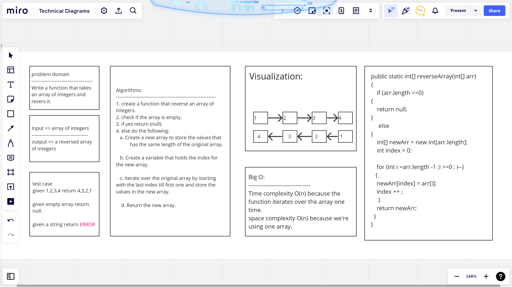

# Code Challenge: Class 01  

In this code challenge. We have a problem domain. Write a function that takes an array of integers and reverses it. So we have many steps to do this code challenge on the whiteboard. First thing. We have to understand the problem domain. Second thing, write the test cases. The third thing is Visualization for what this function inputs look like and what should it return, the Big O,  the algorithms to solve this problem, and the last thing is the code that solves this problem.
 
 ---

 