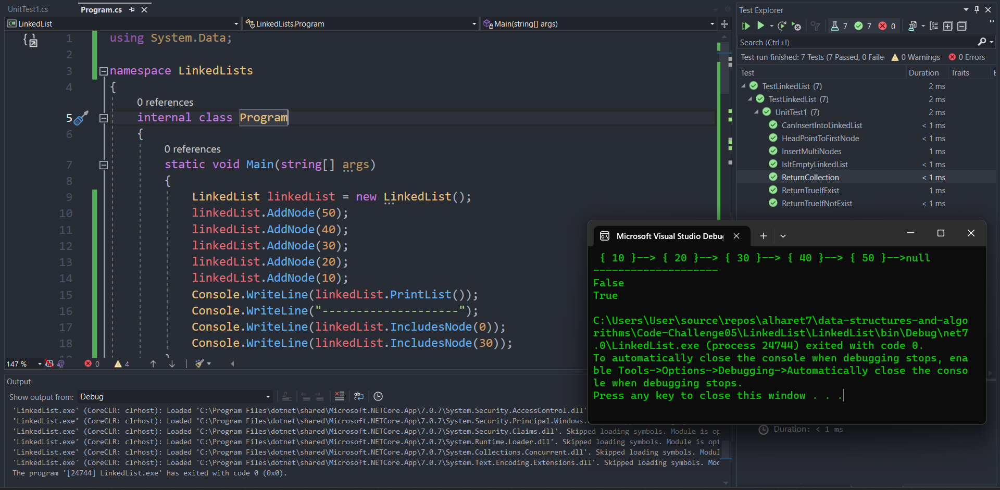

# Linked Lists
- In this code challenge, I made an empty linked list and add values to the head. And I made two more methods, One of them to check the values in the Nods. if it exists, and the other method is to print this linked list.

## Approach & Efficiency

- This is a singly linked list implementation with a head pointer and methods to add nodes, print the list, and check if a value exists in the list. It iterates over the linked list nodes to perform these operations.

- The time complexity of adding a node to the linked list is O(1) as it simply updates the head pointer. The time complexity of printing the list is O(n) as it iterates over all the nodes once. The time complexity of checking if a value exists in the list is also O(n) as it may need to traverse the entire list in the worst case. The space complexity is O(n) as it requires additional memory to store the linked list nodes.
---
## Solution

