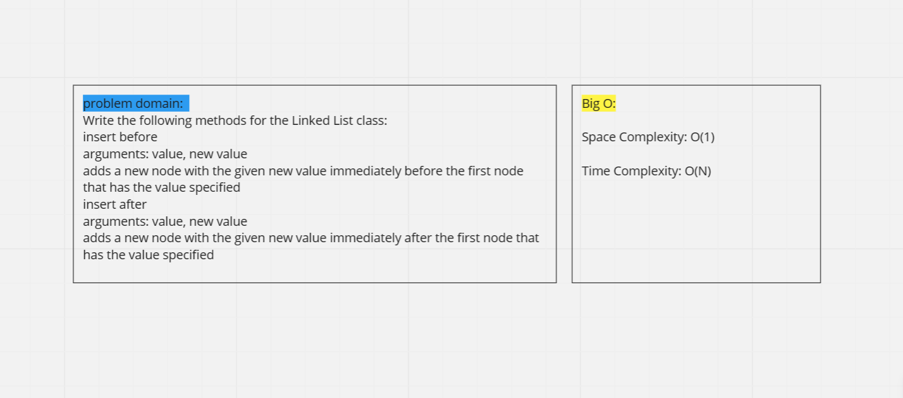
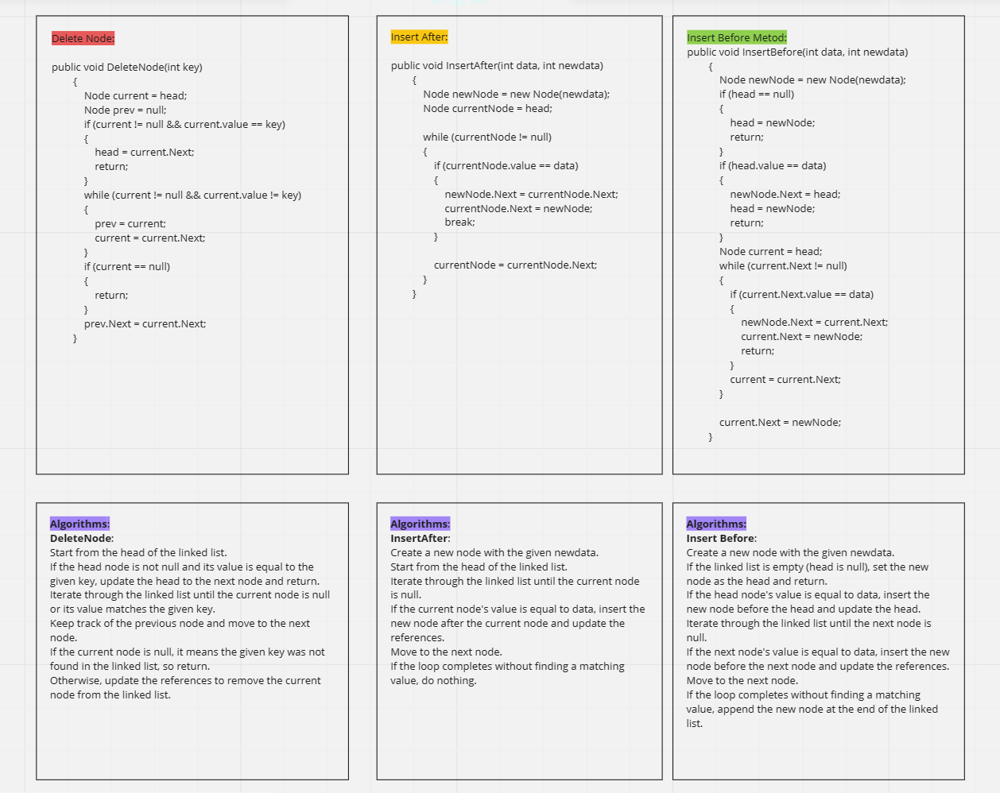
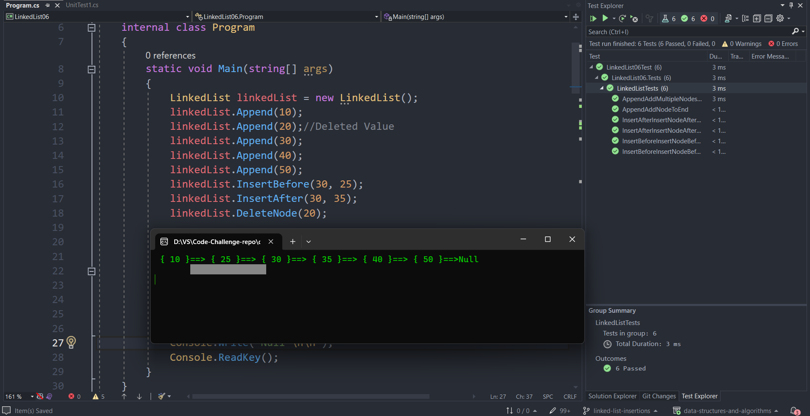
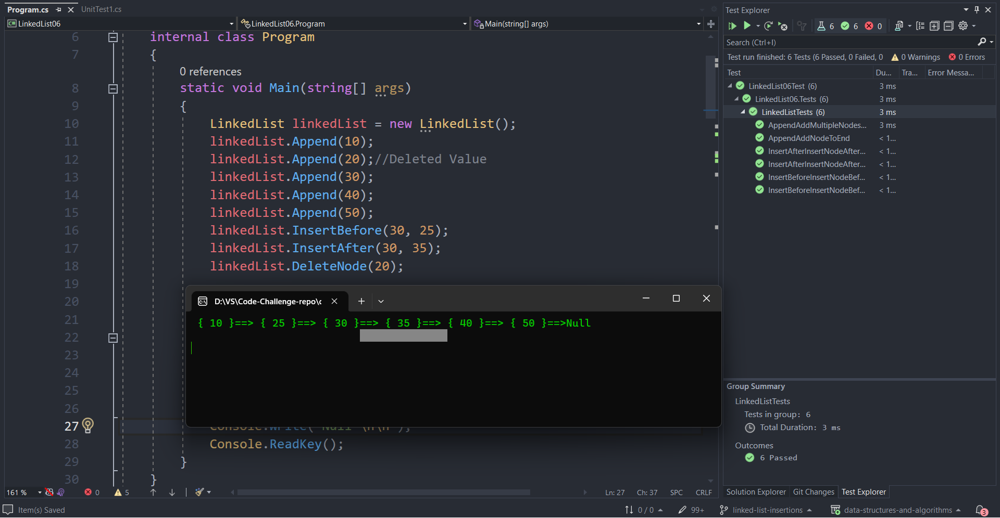
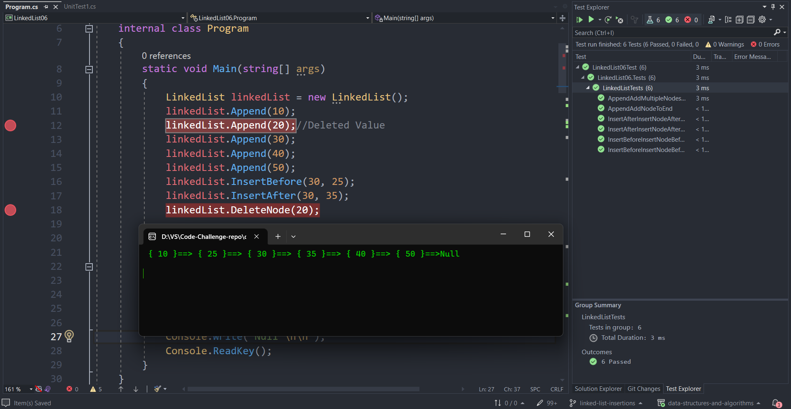

# Linked List CodeChallange 06

## Approach & Efficiency  💯

- This code implements a `singly linked list data structure` with various operations such as **appending nodes**, **inserting nodes** before or after a specified node, and **deleting nodes**. The time complexity for each operation is **O(n)**, where **n** is the number of `nodes` in the list. The space complexity of the linked list is also **O(n)** as it requires memory to store each `node`.
- All tests passed. ✅

### White Board :

#### Appending nodes:

#### inserting nodes
- Inserting |`25`| ***befor*** |`30`|

---

- Inserting |`35`| ***after***|`30`|

## Stretch Goal 🥅

- Delete Node ❌

