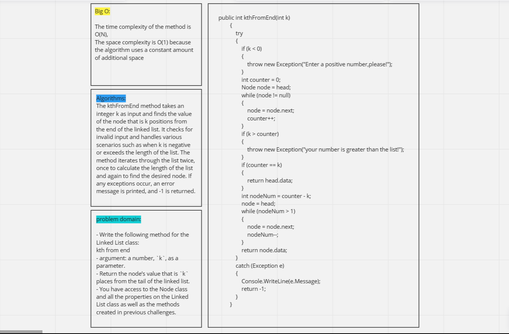
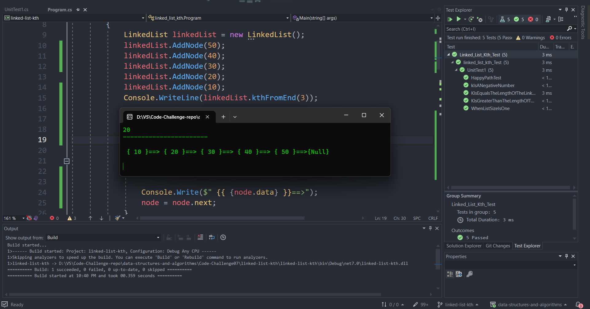
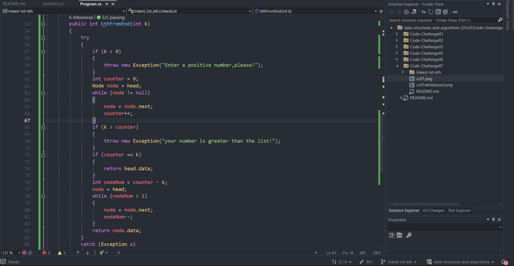

# Code Challenge 07: k-th value from the end of a linked list.

- Write the following method for the Linked List class:

kth from end
- argument: a number, `k`, as a parameter.
- Return the node’s value that is `k` places from the tail of the linked list.
- You have access to the Node class and all the properties on the Linked List class as well as the methods created in previous challenges.

- I built a kthFromEnd method, it takes an integer `k` as input and finds the value of the node that is `k` positions from the end of the linked list. It checks for invalid input and handles various scenarios such as when `k` is negative or exceeds the length of the list. The method iterates through the list twice, once to calculate ***the length*** of the list and again to find ***the desired node***. If any exceptions occur, an `error` message is printed, and -1 is returned.
 ---
## Whiteboard Process

---
## Approach & Efficiency

- The ***approach*** in my code involves traversing the entire linked list to **determine its length**`counter` and **perform necessary validations**. Based on the value of `k`, the position of the desired `node` from the end is calculated as `nodeNum = counter - k`. Finally, another traversal is performed to **reach the desired** `node` and **return** its **value**.

- The time complexity of the `kthFromEnd` method is O(N), where N is the length of the linked list. It iterates through the list twice, once to calculate the length and once to find the desired node.

- The space complexity is O(1) because the algorithm uses a constant amount of additional space, regardless of the input size. It only requires a few variables and exception handling, which do not depend on the input size.

---
## Solution

