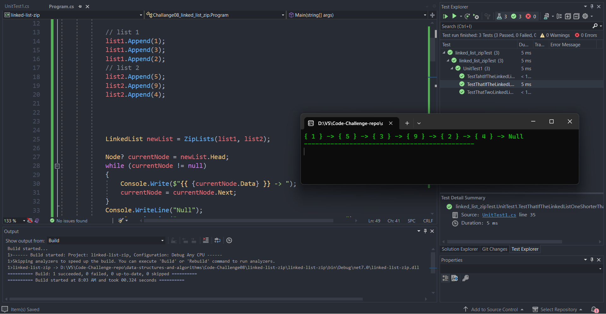
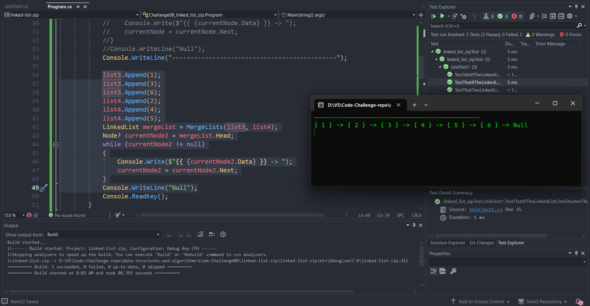
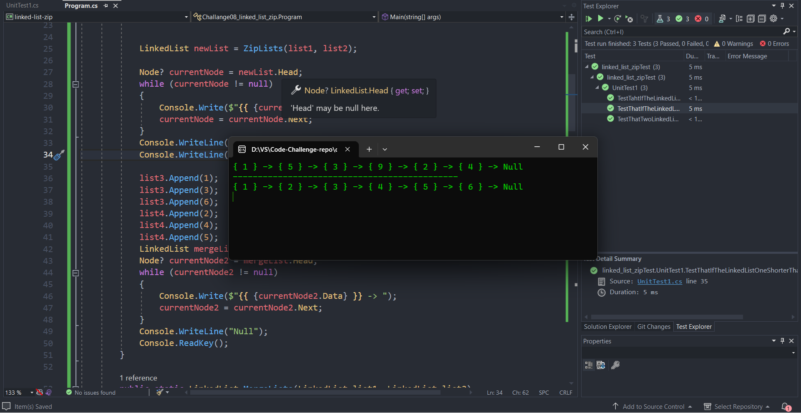

# Challange08-linked-list-zip

This code implements linked lists. It includes methods to merge two lists while maintaining the sorted order and to combine two lists alternately.

## Approach & Efficiency
- I took an iterative approach to merge and combine linked lists. The `MergeLists` method iterates over the nodes of both lists and appends them to a new merged list. The `ZipLists` method also iterates over the nodes of both lists and alternately appends them to a new list.

- The ***time complexity*** (Big O) of the `MergeLists` method is O(n + m), where n and m are the lengths of the input lists `list1` and `list2` respectively. This is because each node from both lists is visited once to construct the merged list.

- The ***time complexity*** of the `ZipLists` method is also O(n + m), as it iterates over the nodes of both lists once to create the new list.

- The ***space complexity*** of both methods is O(n + m) as well since the merged lists created in both cases will have the combined number of nodes from list1 and list2.

## Solution :

---
### Stretch Goal

### All Code
---

