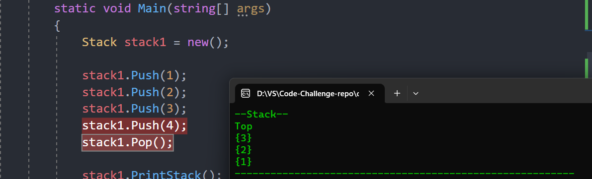

# Stack & Queue 📚
**stack** is a collection of elements that supports two main operations: ***Push***, which adds an element to the collection, and ***Pop***, which removes the most recently added element that was not yet removed. The **Queue** class in C# represents a first-in, first-out (FIFO) collection of objects. It contains elements in the order they were added and supports two main operations: ***Enqueue***, which adds an element to the collection, and ***Dequeue***, which removes the oldest element that was not yet removed.

## Approach & Efficiency 💯
- The `stack class` implements a stack using a singly linked list. It supports standard stack operations:  Push, Pop, Peek, and IsEmpty. The time complexity for these operations is `O(1)` as they operate on the top of the stack. The space complexity is `O(n)` where n is the number of elements in the stack.
- The `Queue class`  implements a queue using a singly linked list. It supports standard queue operations: Enqueue, Dequeue, Peek, and IsEmpty. The time complexity for these operations is `O(1)` as they operate on the front or end of the queue. The space complexity is `O(n)` where n is the number of elements in the queue.

---
## White Borad:📝

---

## Solution : ✅

