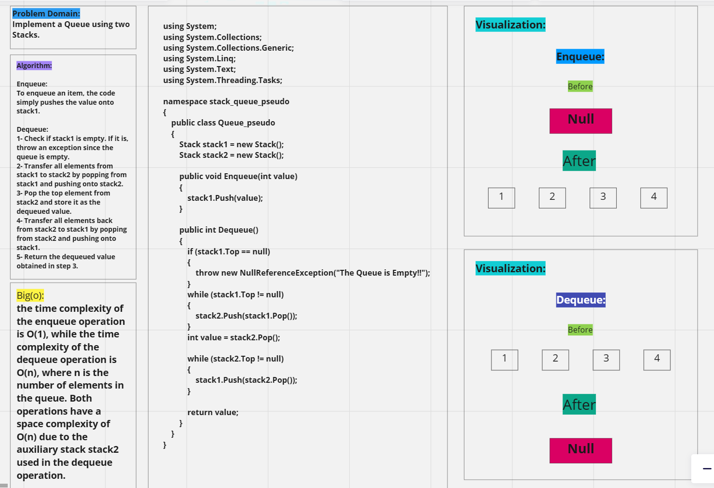
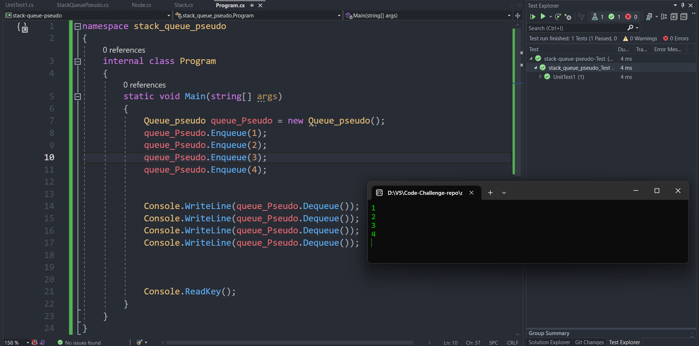

# stack-queue-pseudo

## Whiteboard Process:

---

## Approach & Efficiency:
- This code uses two stacks, `stack1` and `stack2`, to implement a **queue**. The **Enqueue method** simply pushes values onto `stack1`, and the **Dequeue method** transfers elements from `stack1` to `stack2`, pops the top element from `stack2`, and then transfers elements back to `stack1`.
- The **time complexity** of Enqueue is O(1) and the **time complexity** of Dequeue is O(n), while the **space complexity** for both operations is O(n).

---

## Solution:

