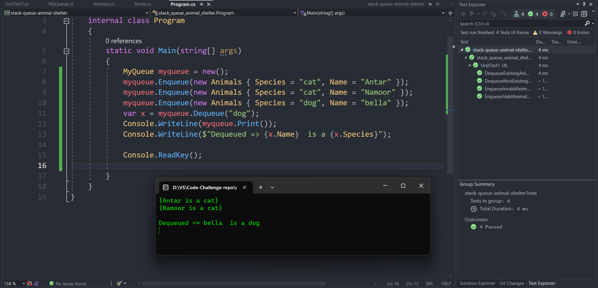

# stack-queue-animal-shelter

 In this code I defined a class `myQueue`, which implements a basic queue data structure for managing a collection of animals. The `enqueue` method allows adding animals with the species "cat" or "dog" to the **back** of the queue by creating new `nodes` and **updating** the `front` and `back` pointers accordingly. The `dequeue` method removes the first occurrence of an animal with a specified species ("cat" or "dog") from the front of the queue, efficiently updating the pointers to reorganize the queue. The code utilizes a singly linked list representation to dynamically handle varying numbers of animals and ensures efficient enqueue and dequeue operations.

## Approach & Efficiency:

The code is about making a line of animals using a list. The code has two main parts: one for adding animals to the end of the line, and one for taking animals out from the start of the line.

Adding animals:

The adding part takes an animal and puts it at the end of the line if it is a cat or a dog. It makes a new spot for the animal and changes the pointers to show where the line starts and ends. This part is fast and does not depend on how many animals are in the line.The Big O for this method is Time:(O(1)) and Space:(O(1))

Taking animals out:

The taking out part takes a type of animal (cat or dog) and removes the first animal of that type from the start of the line. It checks if the type is valid, and then it changes the pointer to show where the line starts. This part can be slow if there are many animals in the line.The Big O for this method is Time: (O(n)) and Space: (O(1))

## solution

