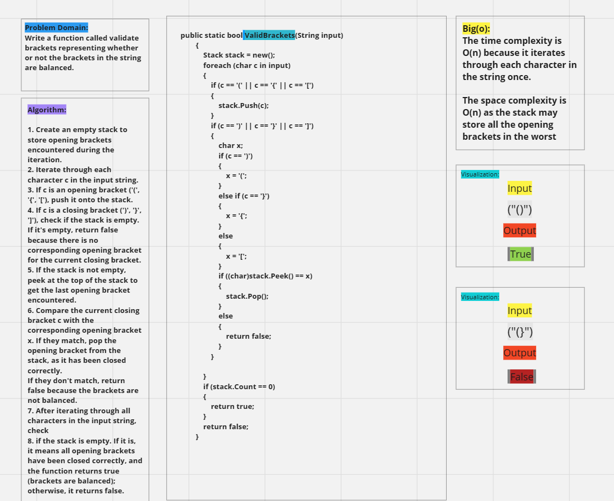

# stack queue brackets

## Approach & Efficiency

This code checks whether a given input string has balanced brackets or not. It does this by employing a stack-based approach to keep track of opening brackets and comparing them with the corresponding closing brackets. The algorithm has a time complexity of O(n) and a space complexity of O(n), where n is the length of the input string.

## Whiteboard Process

## Solution

