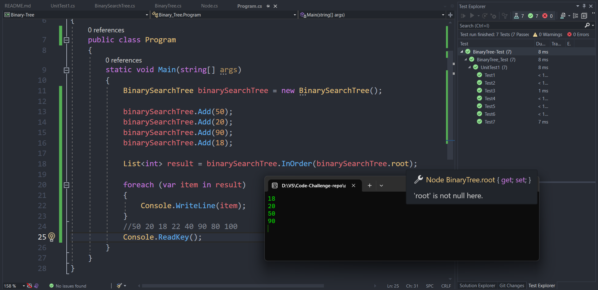

# Binary-Tree

<!-- Description of the challenge -->
An important aspect of trees is how to traverse them. Traversing a tree allows us to search for a node, print out the contents of a tree, and much more! There are two categories of traversals when it comes to trees:
- Depth First

**Depth First**

Depth first traversal is where we prioritize going through the depth (height) of the tree first. There are multiple ways to carry out depth first traversal, and each method changes the order in which we search/print the root. Here are three methods for depth first traversal:

- Pre-order: root >> left >> right
- In-order: left >> root >> right
- Post-order: left >> right >> root

**Add Node to binary search tree**
You are given the root node of a binary search tree (BST) and a value to insert into the tree. Return the root node of the BST after the insertion. It is guaranteed that the new value does not exist in the original BST.

**Search in binary search tree**
Binary Search Tree is a node-based binary tree data structure which has the following properties:

- The left subtree of a node contains only nodes with keys lesser than the node’s key.
- The right subtree of a node contains only nodes with keys greater than the node’s key.
- The left and right subtree each must also be a binary search tree. 
- There must be no duplicate nodes.
---
## Approach & Efficiency
<!-- What approach did you take? Why? What is the Big O space/time for this approach? -->
| Method    | Time Complexity |Space Complexity|
|-----------|-----------------|----------------|
| Contains  | O(log n)         | O(1)          |
|  Add      | O(height)        | O(1)          |

---

## Whiteboard

---

## Solution
