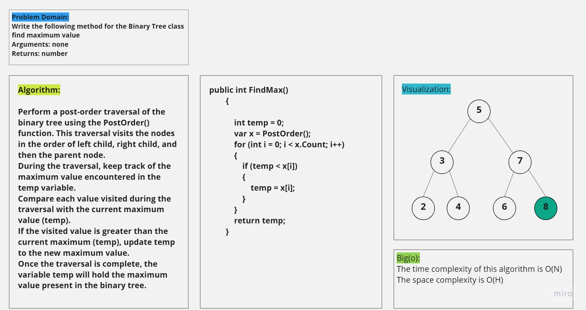
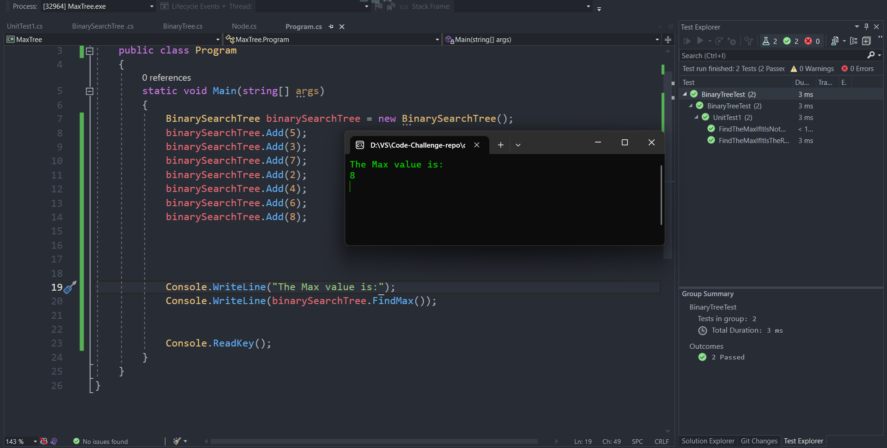

# FindMax

In this method its created to find the max number in the tree even it is the root or not and the time complexity for it is O(N) because we iterate on the tree elements and the space complexity is O(N) that because we use a method in it and that method use recursion

## White board

## solution

