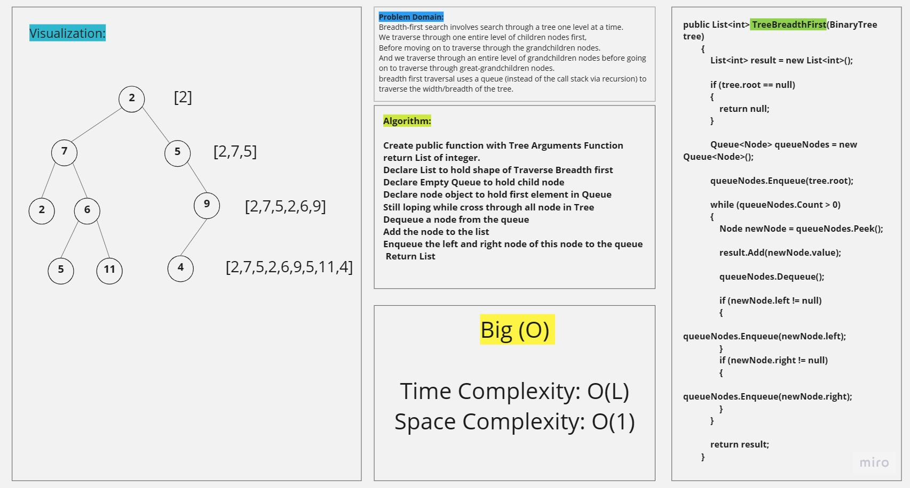
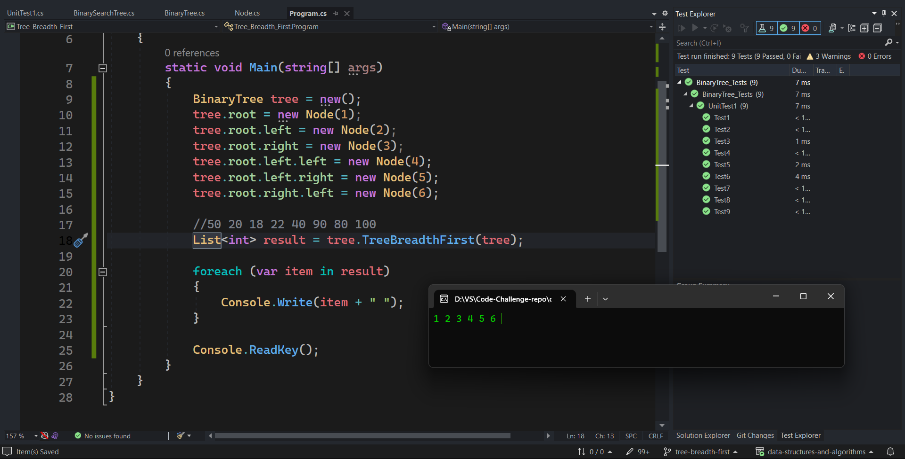
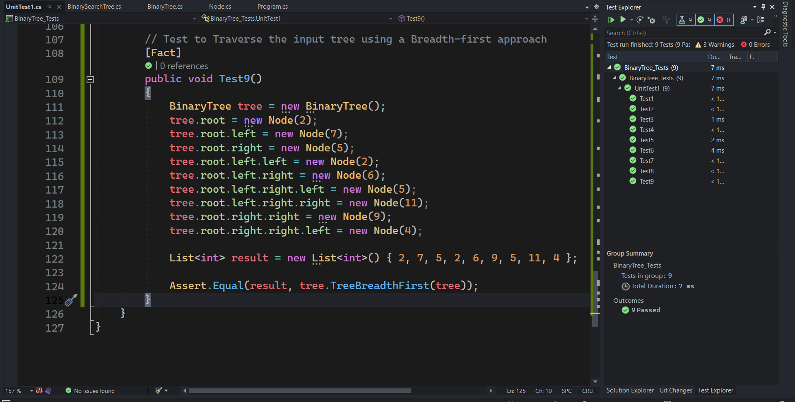

# Tree breadth first

**Traverse Tree using a Breadth-first approach**

Breadth-first search involves search through a tree one level at a time.
- We traverse through one entire level of children nodes first, 
- Before moving on to traverse through the grandchildren nodes. 
- And we traverse through an entire level of grandchildren nodes 
- Before going on to traverse through great-grandchildren nodes.

breadth first traversal uses a queue (instead of the call stack via recursion) to traverse the width/breadth of the tree.

## Approach & Efficiency

| Method    | Time Complexity |Space Complexity|
|-----------|-----------------|----------------|
| Breadth-first       | O(n)  | O(1)           |

## Whiteboard

## Solution

## Test

