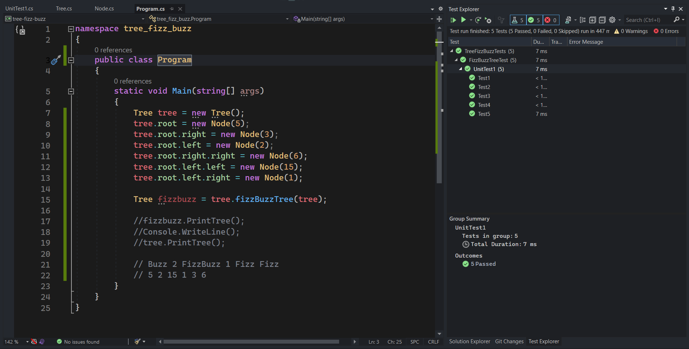

# Tree Fizz-Buzz:

**Fizz Buzz Tree Implementation**
Conduct “FizzBuzz” on a binary Tree while traversing through it. Create a new tree have same old Tree shape , And change the values of each of the nodes dependent on the current node’s value .  

New Tree must follow FizzBuzz rules :

- If the value is divisible by 3, replace the value with “Fizz”
- If the value is divisible by 5, replace the value with “Buzz”
- If the value is divisible by 3 and 5, replace the value with “FizzBuzz”
- If the value is not divisible by 3 or 5, simply turn the number into a String

## Approach & Efficiency
<!-- What approach did you take? Why? What is the Big O space/time for this approach? -->
| Method    | Time Complexity |Space Complexity|
|-----------|-----------------|----------------|
| Fizz Buzz | O(n)            | O(1)           |

## Whiteboard Process

## Solution
<!-- Show how to run your code, and examples of it in action -->

