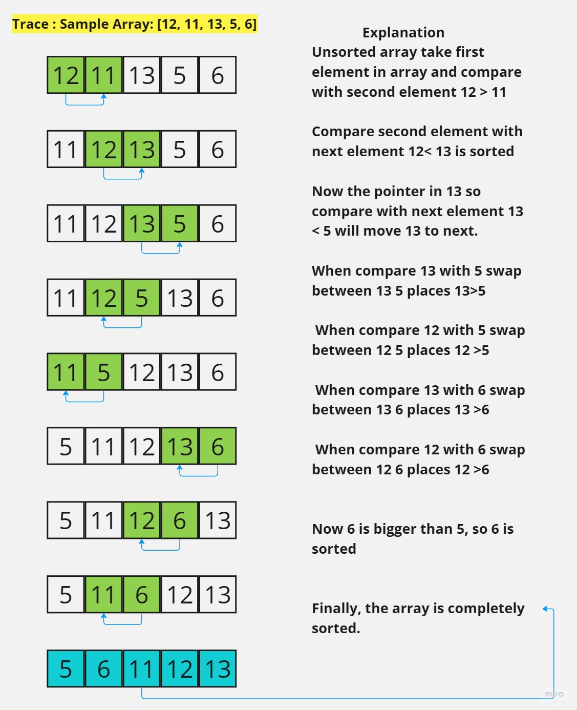
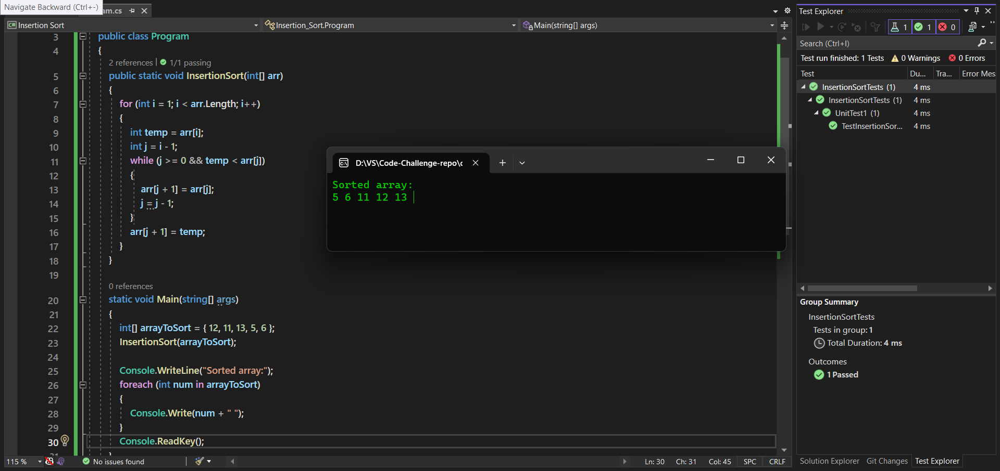

# Insertion Sort

Insertion sort : is a simple sorting algorithm that works similar to the way you sort playing cards in your hands. The array is virtually split into a sorted and an unsorted part. Values from the unsorted part are picked and placed at the correct position in the sorted part.

## Pseudocode

```
  InsertionSort(int[] arr)

    FOR i = 1 to arr.length

      int j <-- i - 1
      int temp <-- arr[i]

      WHILE j >= 0 AND temp < arr[j]
        arr[j + 1] <-- arr[j]
        j <-- j - 1

      arr[j + 1] <-- temp
```

## Trace


## solution


## Efficency

- Time Complexity 
    
    - The worst case is when the entire array is sorted in descending order. In that case, we have to check N elements and swap N elements for each selected element. Hence the time complexity is O(N^2)

- Space 

    - Since the array is sorted in place and no extra space is used, the space complexity is O(1)