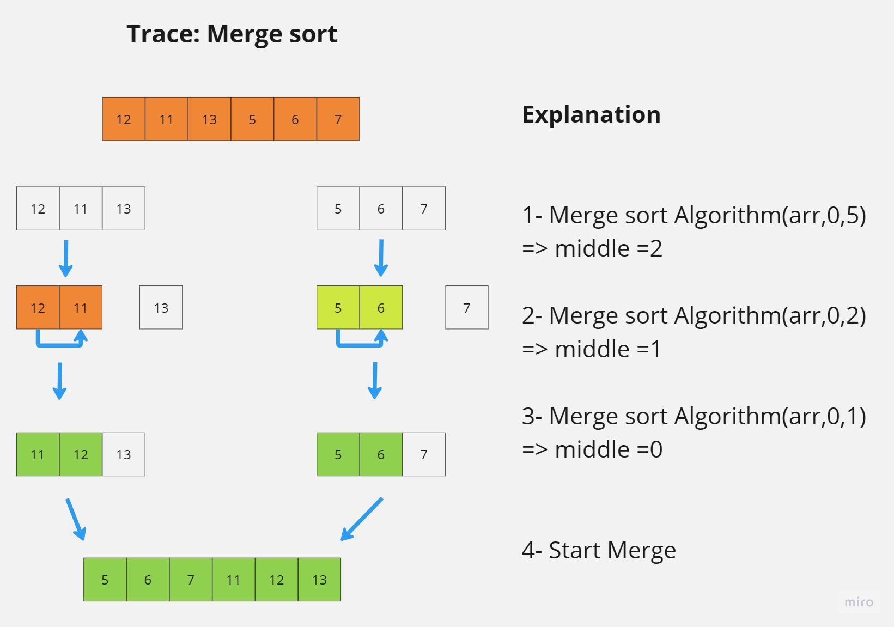
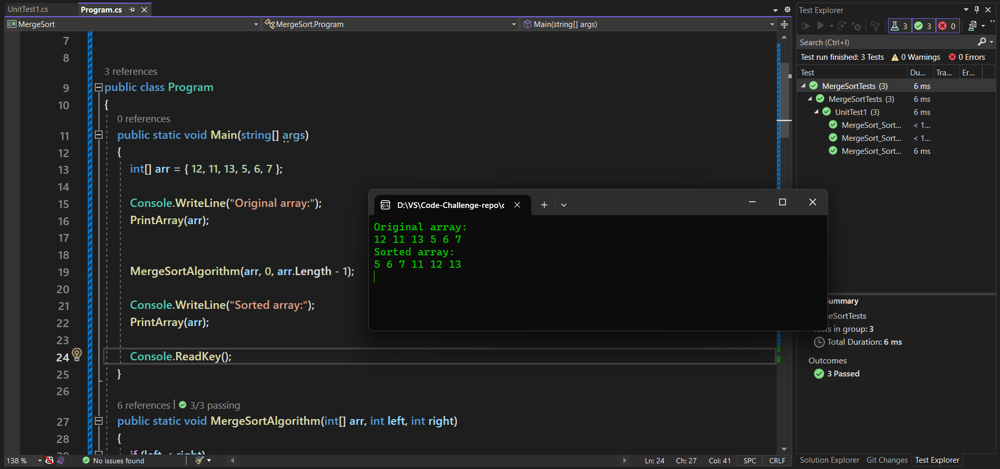

#  Merge Sort

Merge Sort is a fast sorting algorithm, that follows the **devide and conqure** approach
to sort an array.
It divides its input into two halves until it reaches arrays of size 1 or less than one.
Then compare and merges each 2 halfs together, until we have the full array sorted.

# Tracing

# Code & Tests
