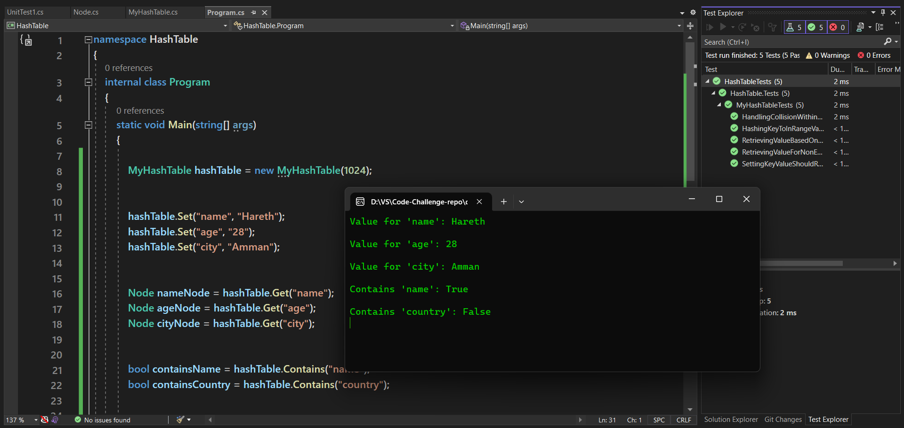
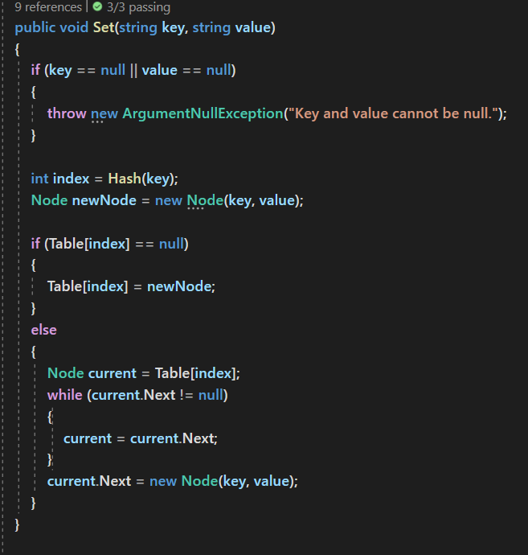
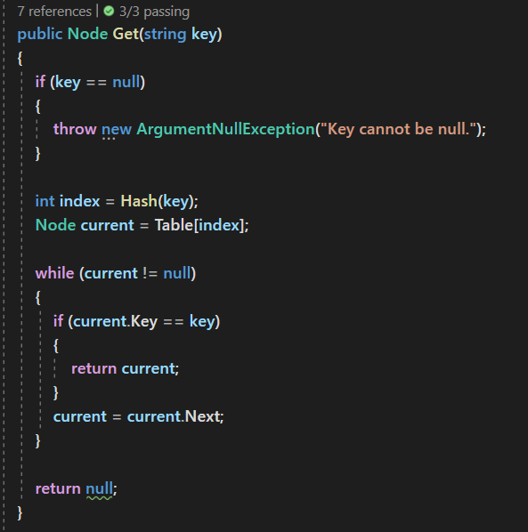
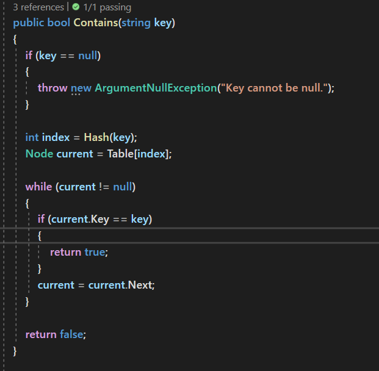

# Challenge Summary

## Hash Table

Hashtables are a data structure that utilize key value pairs. This means every Node or Bucket has both a key, and a value.
The basic idea of a hashtable is the ability to store the key into this data structure, and quickly retrieve the value. This is done through what we call a hash. A hash is the ability to encode the key that will eventually map to a specific location in the data structure that we can look at directly to retrieve the value.

## Approach & Efficiency

| Method    | Time Complexity |Space Complexity|
|-----------|-----------------|----------------|
| Contains  | O(1) on average           | O(1)           |
| Set       | O(1) on average           | O(1)           |
| get       | O(1)  on average          | O(1)           |

## Solution

