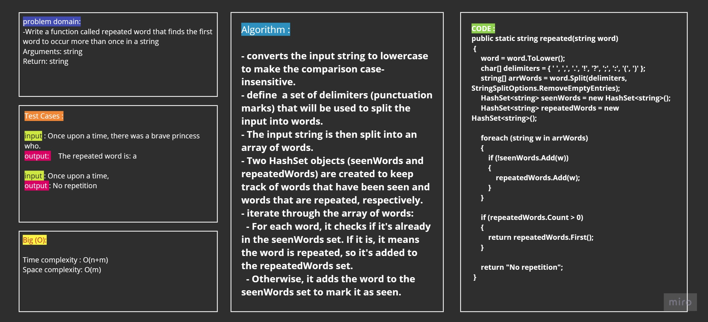
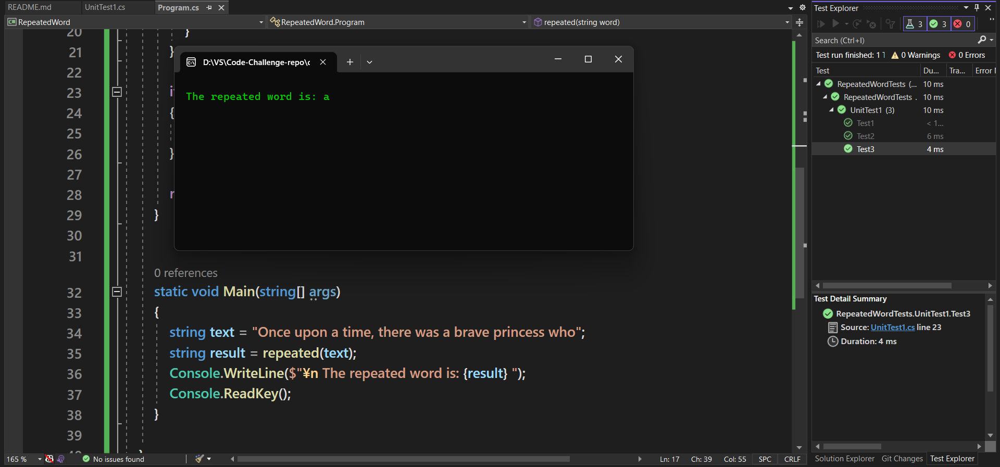

# RepeatedWord

In this program, we need to find out the duplicate words present in the string and display those words.
To find the duplicate words from the string, we first split the string into words. We count the occurrence of each word in the string. If count is greater than 1, it implies that a word has duplicate in the string.

## Algorithm

- converts the input string to lowercase to make the comparison case-insensitive.
- define  a set of delimiters (punctuation marks) that will be used to split the input into words.
- The input string is then split into an array of words.
- Two HashSet objects (seenWords and repeatedWords) are created to keep track of words that have been seen and words that are repeated, respectively.
- iterate through the array of words:
  - For each word, it checks if it's already in the seenWords set. If it is, it means the word is repeated, so it's added to the repeatedWords set.
  - Otherwise, it adds the word to the seenWords set to mark it as seen.

## Approach & Efficiency
<!-- What approach did you take? Why? What is the Big O space/time for this approach? -->
| Method    | Time Complexity |Space Complexity|
|-----------|-----------------|----------------|
| Repeated       | O(n+m)  | O(m)       |

## Whiteboard Process

## Solution
