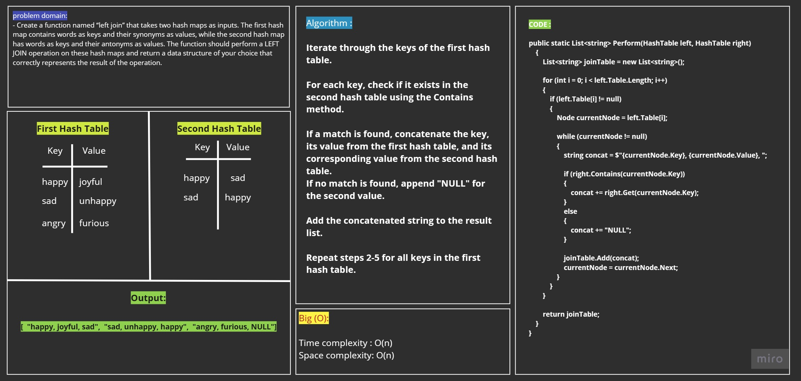

# Hashmap left join

The `LeftJoin` method takes two hash tables as input. It performs a left join operation, where it iterates through the keys of the first hash table. For each key, it checks if it exists in the second hash table. If a match is found, it concatenates the key, its value from the first hash table, and its corresponding value from the second hash table. If no match is found, it appends "NULL" for the second value. The result is a list of strings representing the left join operation.

## White Board
