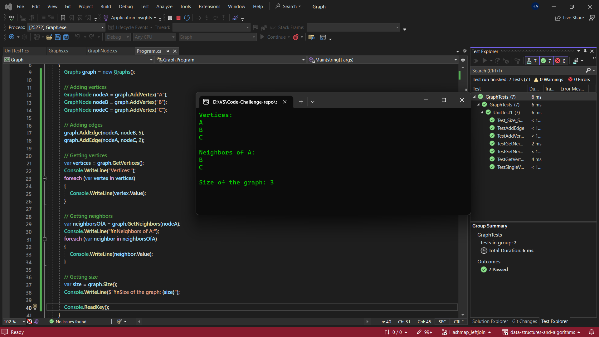

# Graph 

## Challenge

To implement the Graph and node class. Created instance methods for the Graph class: addNode(), addEdge(), getNodes(), getNeighbors(), size().

---

## Solution

AddNode()

- Adds a new node to the graph
- Takes in the value of that node
- Returns the added node

AddEdge()

- Adds a new edge between two nodes in the graph
- Include the ability to have a “weight”
- Takes in the two nodes to be connected by the edge
- Both nodes should already be in the Graph

GetNodes()

- Returns all of the nodes in the graph as a collection (set, list, or similar)

GetNeighbors()

- Returns a collection of nodes connected to the given node
- Takes in a given node
- Include the weight of the connection in the returned collection

Size()

- Returns the total number of nodes in the graph

---

## Approach & Efficiency

| Method                                     | Time Complexity | Space Complexity |
|--------------------------------------------|-----------------|------------------|
| Add Vertex                                 | O(1)            | O(1)             |
| Add Edge                                   | O(1)            | O(1)             |
| Get Vertices                               | O(1)            | O(N)             |
| Get Neighbors                              | O(E)            | O(E)             |
| Get Neighbors With Weight                  | O(1)            | O(1)             |
| Size                                       | O(1)            | O(1)             |
| Single Vertex and Edge                     | O(1)            | O(1)             |

## Solution & Tests:

