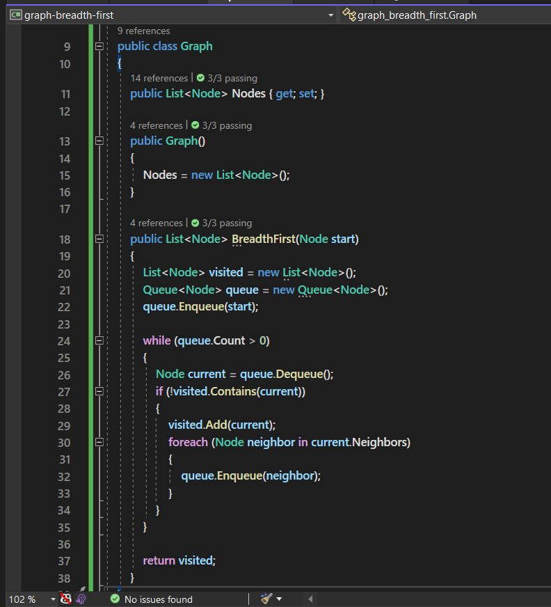

# Graph Breadth First

this method is to perform a breadth-first traversal of a graph, which means it systematically explores all reachable nodes from the starting node, moving level by level.

## Algorithm 

- Create an empty list called visited to keep track of visited nodes.
- Create a queue called queue and enqueue the starting node.
- While the queue is not empty:
  1. Dequeue a node from the queue and mark it as visited.
  2. Add the node to the visited list.
  3. Enqueue all unvisited neighbors of the node.
- Continue this process until the queue is empty.

---

## Approach & Efficiency

Time | Space
--- | ---
O(v+E) | O(v)

---

## Solution and Tests

