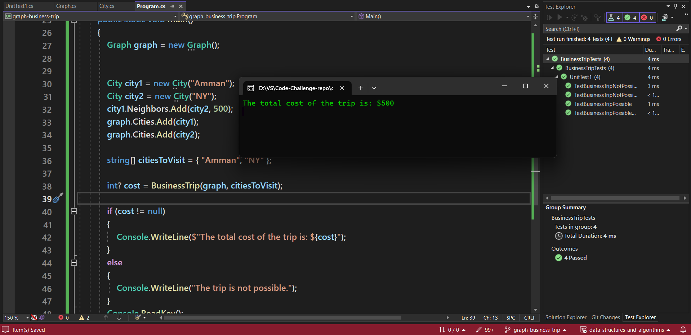
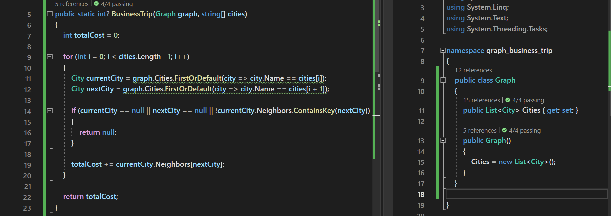

# Business Trip

This  method aims to determine the cost of a trip based on a provided graph and an array of city names. It checks if it's possible to travel directly between the specified cities and calculates the total cost if the trip is feasible.

## Algorithm 

- Initialize totalCost to 0.
- Iterate through the cities array from index 0 to length - 2:
  - Get the current city (currentCity) and the next city (nextCity) based on their names.
  - If either currentCity or nextCity is null, or there is no direct connection between them, return null.
  - Otherwise, add the cost of traveling from currentCity to nextCity to totalCost.
- Return totalCost.

## Approach & Efficiency

| Time Complexity |Space Complexity|
|-----------------|----------------|
| O(n)            | O(1)           |
 

 ## Solution
 
 