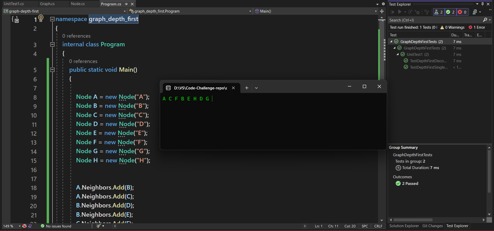

# Graph Depth First

This method performs a depth-first traversal on a graph, starting from a specified node, and returns a collection of nodes in the order they were visited.

---

## Algorithm
- Initialize an empty list result to store visited nodes.
- Initialize a HashSet called visited to keep track of visited nodes.
- Create a Stack called stack to keep track of nodes to be visited.
- Push the start node onto the stack.
-While the stack is not empty:
  - Pop a node tempNode from the stack.
  - If tempNode has not been visited:
    - Add tempNode to the result.
    - Mark tempNode as visited by adding it to the visited set.
    - push all unvisited neighbors of tempNode onto the stack.
- Return the result list containing nodes in the order they were visited.

---

## Approach & Efficiency

Time | Space
--- | ---
O(V+E) | O(V)

---

## Solution
